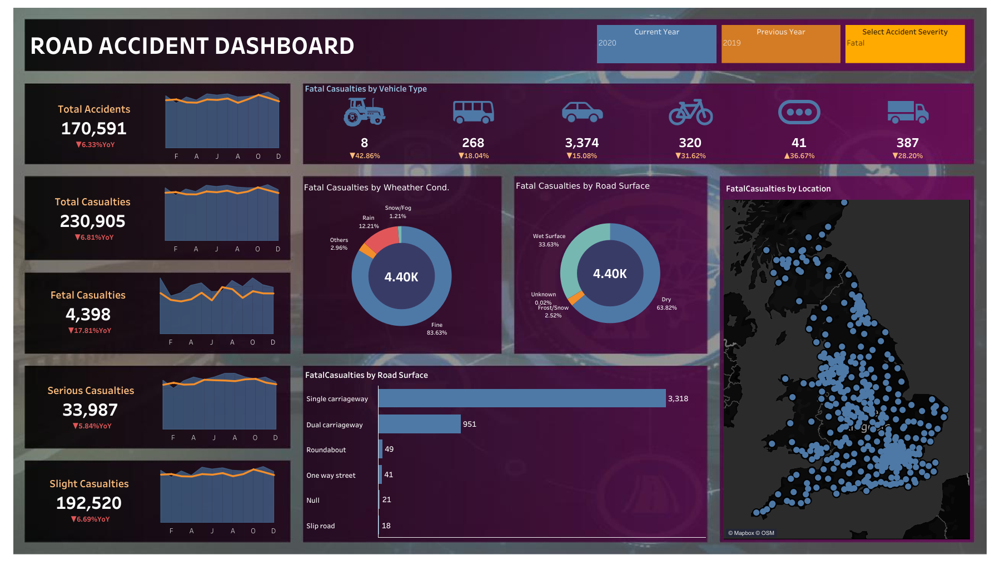

# Road_Accident_Dashboard
This is a Tableau Public dashboard created using dummy data to represent road accident trends.   The dataset is fictional and meant for learning and practice purposes only.

# Road Accident Dashboard

This project is a Tableau Public Dashboard created using dummy data to represent road accident trends in India.  
The dataset is fictional and meant for learning and practice purposes only.

🔗 **Live Dashboard Link:**  
[Click here to view the Dashboard](https://public.tableau.com/app/profile/bhavesh.choudhary5458/viz/Road_Acciedent_Dashboard/Dashboard1)

📊 **Tableau Public Profile:**  
[Visit my Tableau Public Profile](https://public.tableau.com/app/profile/bhavesh.choudhary5458)

---

## 📁 Dataset

The dataset used for this dashboard is uploaded as a ZIP file in this repository:  
📂 **[Download road_accident_data.zip](./road_accident_data.zip)**

It contains fictional data about:
- Total accidents per year
- Vehicle types involved
- Casualties (fatal, serious, slight)
- State-wise and location-wise stats
- Weather and road conditions

---

## 📸 Dashboard Preview

---
Disclaimer: This dashboard was created as part of a learning activity using publicly available resources.  
> The dataset and concept were inspired by an educational YouTube video. The entire implementation and execution were done independently.
